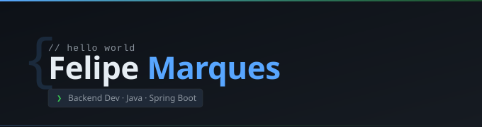

### Desenvolvedor Backend Java | Spring Boot, APIs REST e PostgreSQL

Desenvolvedor Backend com foco no ecossistema Java e Spring Boot, interessado em arquitetura de software, APIs REST e desenvolvimento de soluções reais.

Atualmente estudando Ciência da Computação e construindo projetos voltados para backend, boas práticas e sistemas escaláveis.

---

## 🛠️ Tecnologias e Ferramentas

<table>
  <tr>
    <td width="200"><strong>Back-End</strong></td>
    <td>
      
      
      
    </td>
  </tr>

  <tr>
    <td><strong>API & Testes</strong></td>
    <td>
      
      
    </td>
  </tr>

  <tr>
    <td><strong>Banco de Dados</strong></td>
    <td>
      
      
      
    </td>
  </tr>

  <tr>
    <td><strong>DevOps</strong></td>
    <td>
      
      
    </td>
  </tr>

  <tr>
    <td><strong>Ferramentas</strong></td>
    <td>
      
      
    </td>
  </tr>
</table>
    
---

## 📊 GitHub Stats

| | |
| :---: | :---: |
|  |  |

---

## 📫 Contato

 
